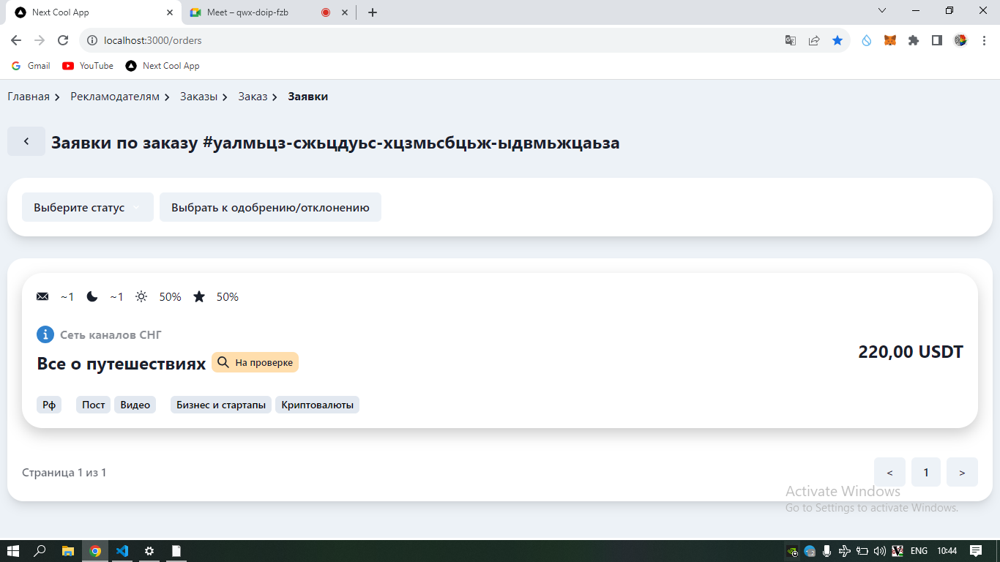
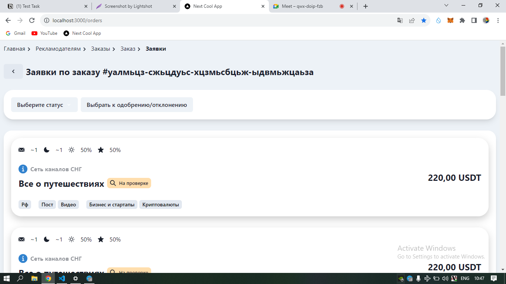
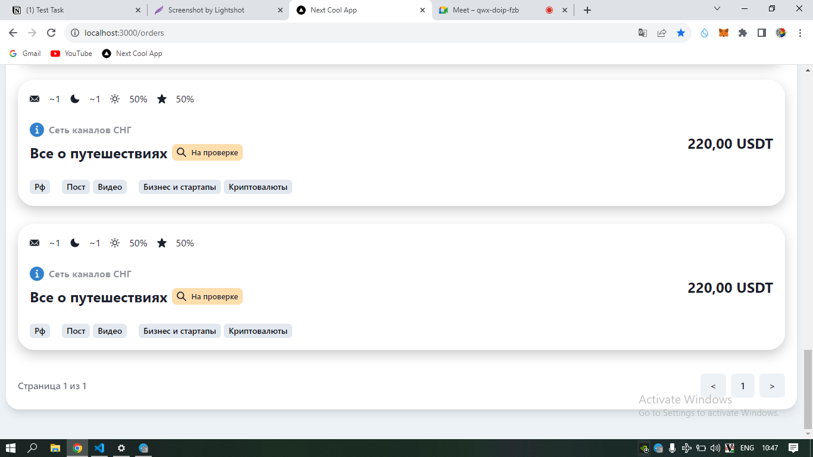
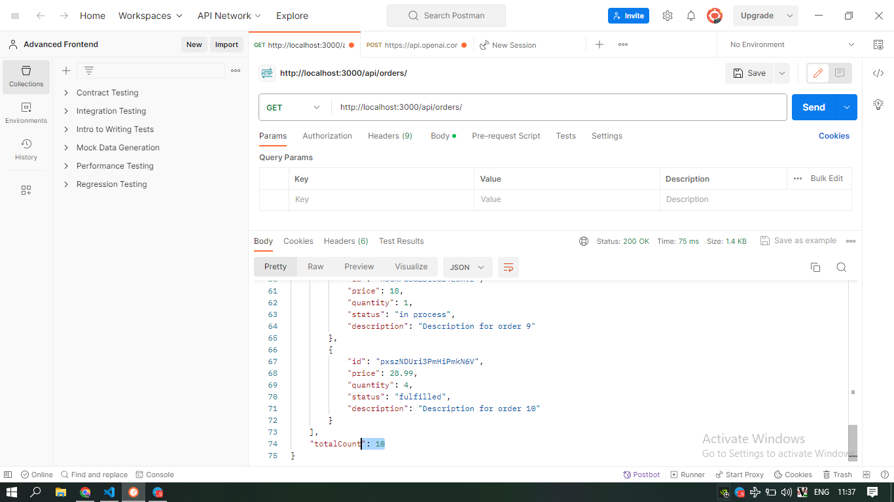
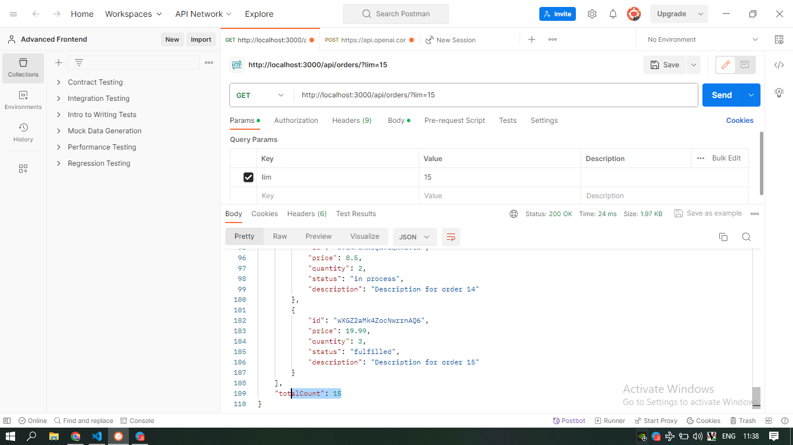
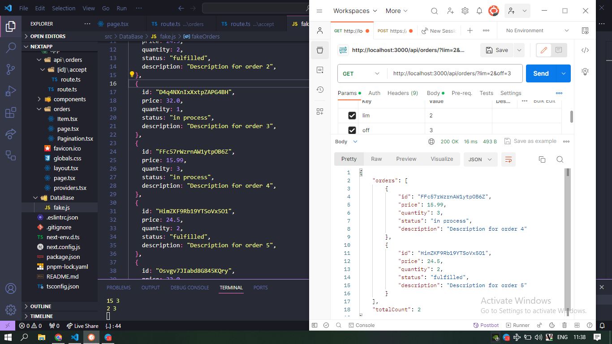
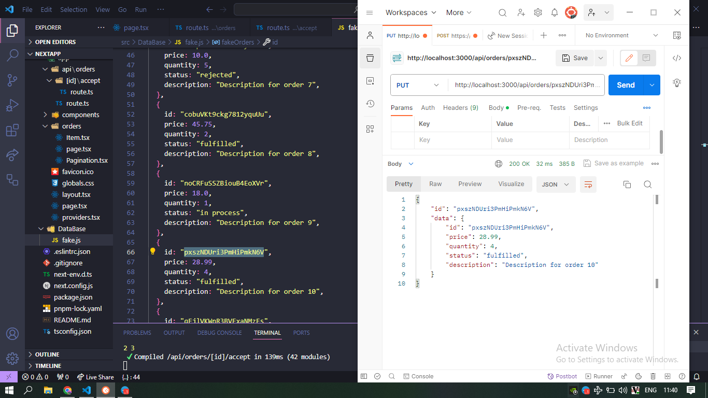
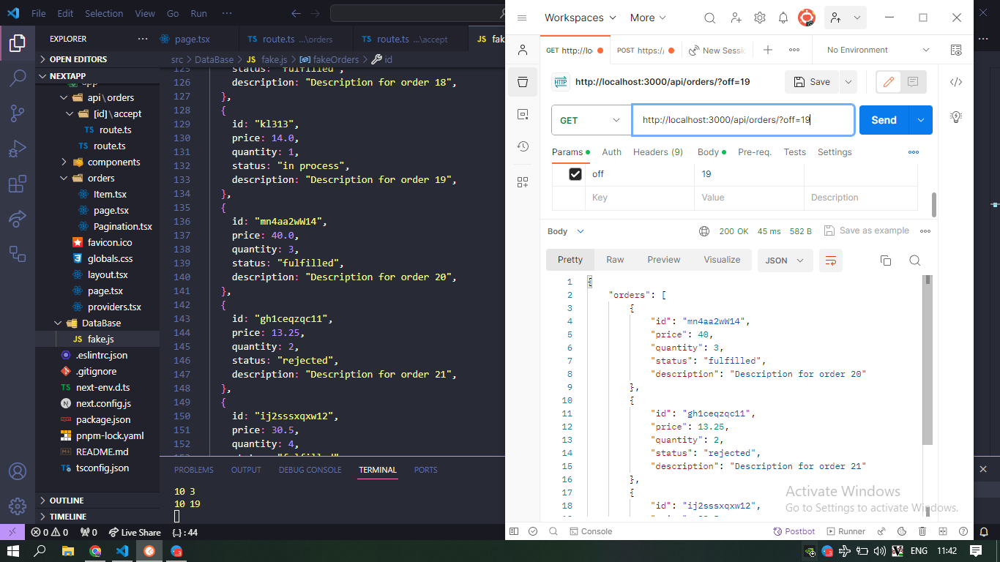

# Accept Order App

## Локальное развертывание проекта

```bash
# Склонировать репозиторий:
git clone https://github.com/Mindsurfer7/SSR-App

# Установить зависимости:
npm i

# ИЛИ  с использованием Yarn:
yarn

# ИЛИ  с использованием PNPM:
pnpm install

# Запустить проект:
npm run dev

# Открыть страницу заказов:
# Откройте ваш веб-браузер и перейдите по следующему адресу:
http://localhost:3000/orders
```

# Верстка

### С одним заказом



### С многими заказами



### Низ страницы



# Запросы

### Все заказы



### С лимитом



### С лимитом и оффсетом



### Проверка с неправильным ID


### Конкретная заявка по ID



### Дополнительная проверка



### Документация функционала


### Проверка с неправильным адресом запроса


